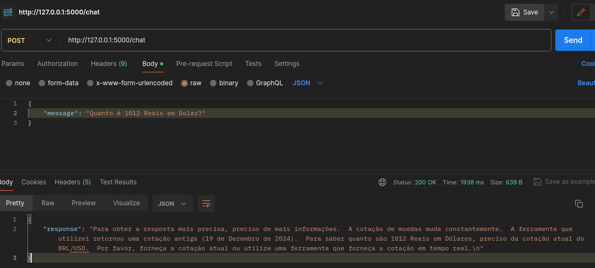

# Atividade Recuperativa - Implementação de Chatbot (LLM)

Nesta atividade, foi escolhida a **Opção 2: Integração com Dados Externos**.

---

## 1. Escolha da API Pública

A API utilizada foi a [AwesomeAPI](https://docs.awesomeapi.com.br/api-de-moedas), que permite obter cotações entre moedas.

---

## 2. Personalização do Chatbot e Novas Funcionalidades

O chatbot utilizado para interpretar perguntas do usuário e, a partir delas, realizar requisições à **API de cotações**. As respostas da API são então processadas e exibidas de forma direta e objetiva no chat.

---

## 3. Documentação das Modificações

O principal ajuste no chatbot foi a utilização da [Function Calling](https://ai.google.dev/gemini-api/docs/function-calling/tutorial?lang=python). Essa funcionalidade foi utilizada para chamar a função responsavel por fazer a requisição a API.  

Inicialmente, foi criada uma função que realiza a requisição à API. Essa função foi declarada no modelo, permitindo que o chatbot leve ela em conta quando formular a resposta. Veja a imagem a seguir:  
  

Um prompt personalizado foi configurado para orientar o modelo a identificar a necessidade de chamar a função declarada. O exemplo está ilustrado abaixo:  
  

Após o modelo gerar a primeira resposta, os argumentos da função são validados e enviados para execução. O resultado da API é enviado novamente para o modelo, que por fim exime uma nova mensagem ao usuário no chat, como demonstrado na imagem:  
  

O resultado da interação pode ser vista na imagem a seguir:
  


---

### Exemplos de Interação

- **Cotação entre duas moedas:**  
    

- **Conversão entre duas moedas:**  
    

- **Conversão entre moedas estrangeiras:**  
    

- **Conversão de Bitcoin para Real:**  
    

---

## 4. Limitações Identificadas

- **Falhas no uso do Function Calling:**  
  Em alguns casos, o chatbot não indentifica a necessidade de chamar a função, retornando apenas uma texto padrão:  
    

- **Códigos de moeda inválidos:**  
  O modelo ocasionalmente gera códigos inexistentes, resultando em erros na API:  
    


# Como Rodar o projeto:
## Passo 1: Configuração do Ambiente

1. **Instale o Python 3.10 ou superior**:

   - Baixe e instale o Python a partir do [site oficial do Python](https://www.python.org/).
   - Código testado com o python 3.10

2. **Crie um ambiente virtual**:

   ```bash
   python -m venv venv
   ```

   - Isso evita que os requisitos deste projeto se misturem com os demais da máquina

3. **Ative o ambiente virtual**:

   - **Windows**:
     ```bash
     venv\Scripts\activate
     ```
   - **macOS/Linux**:
     ```bash
     source venv/bin/activate
     ```
   - Execute o seguinte comando para garantir que o Python que está sendo usado é o do ambiente virtual. Windows: where python ou macOS/Linux: which python
   - O caminho deve apontar para o diretório do ambiente virtual, algo com venv: 'c:\caminho\do\projeto\venv\Scripts\python.exe'

4. **Instale as bibliotecas necessárias**:
   ```bash
   pip install -q -U google-generativeai Flask
   ```

## Passo 2: Obtenção da Chave de API do Gemini

1. **Crie uma conta no Google AI Studio**:

   - Acesse o [Google AI Studio](https://ai.google.dev/).

2. **Obtenha a chave de API**:

   - Siga o guia detalhado disponível neste link: [Gemini API Quickstart](https://ai.google.dev/gemini-api/docs/quickstart?hl=pt-br&lang=python).

3. **Configure a chave de API no terminal**:
   - **Windows**:
     ```bash
     set GEMINI_API_KEY=sua_chave_api_aqui
     ```
   - **macOS/Linux**:
     ```bash
     export GEMINI_API_KEY=sua_chave_api_aqui
     ```

## Passo 3: Rodando o Chatbot

2. **Execute o servidor Flask**:

   - No terminal, execute o seguinte comando para iniciar o servidor:
     ```bash
     python src/app.py
     ```

3. **Interaja com o chatbot**:
   - Use o comando `curl` para testar o chatbot:
     ```bash
     curl -X POST http://127.0.0.1:5000/chat -H "Content-Type: application/json" -d '{"message": "Qual é a cotação Dolar Real?"}'
     ```